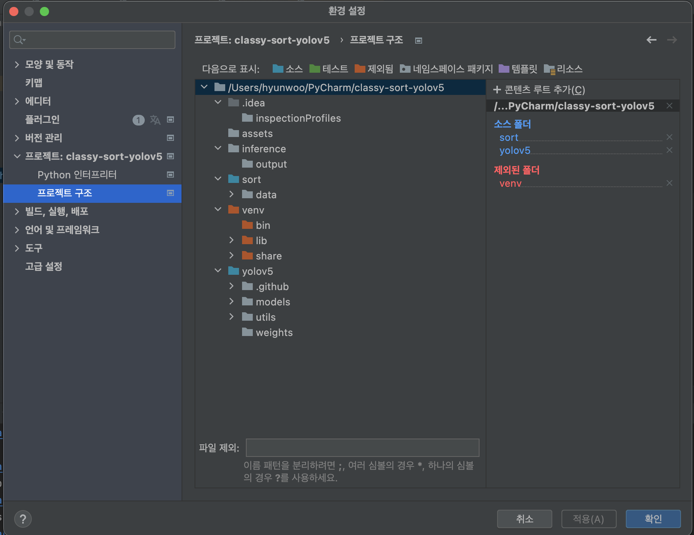
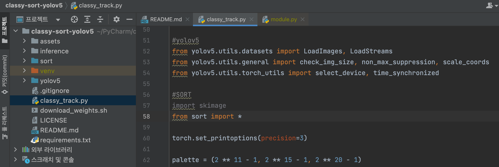
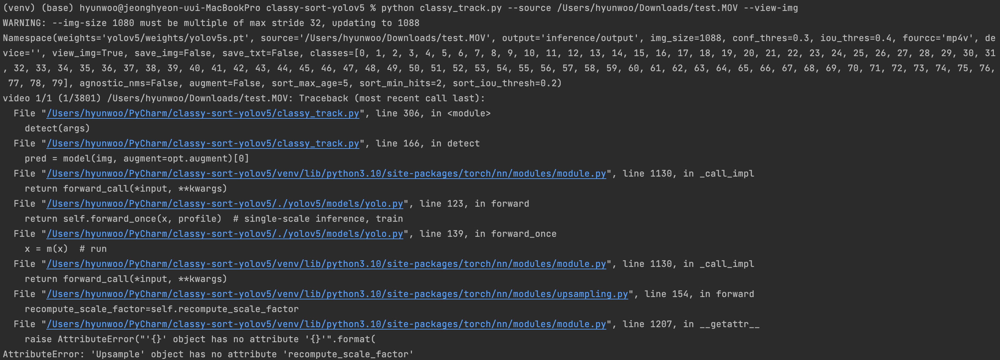
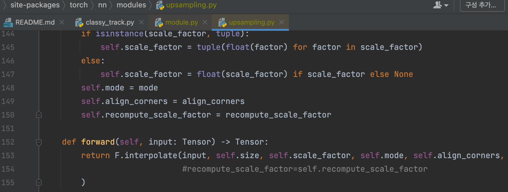
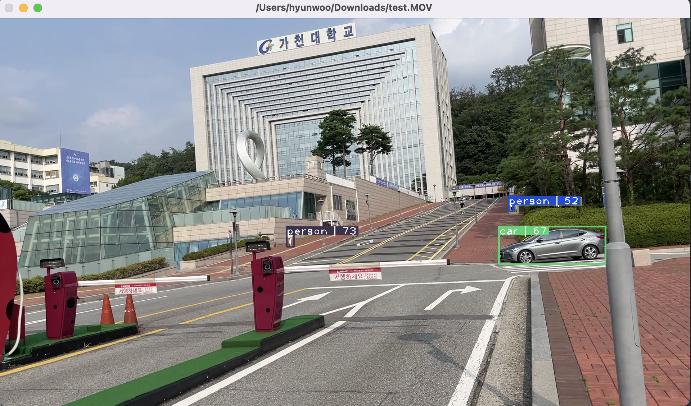

# MoodangE_tracking

<details open>
<summary>Install</summary>

```bash
git clone https://github.com/MoodangE/MoodangE_tracking  # clone
cd MoodangE_ver1
pip install -r requirements.txt  # install
```

</details>
<details open>
<summary>Inference with tracking.py</summary>

`tracking.py` runs inference on a variety of sources,
downloading [models](https://github.com/ultralytics/yolov5/tree/master/models) automatically from the latest
YOLOv5 [release](https://github.com/ultralytics/yolov5/releases) and saving results to `runs/detect`.

- Using webacam

```bash
python tracking.py --source 0 # webcam
```

- Using Video file

```bash
python tracking.py --source "path/vid.mp4" --view-img # video
```

- Using 'custom weights' 
```bash
python tracking.py --weights "path/custom_weight.pt" --data "path/custom_yaml.yaml" --source "path\vide.mp4" --view-img
```

</details>

<details open>
<summary>Train</summary>

```bash
cd yolov5
python train.py --img 640 --batch 4 --epochs 5 --data customDataset/gachon_road.yaml --cfg models/yolov5s.yaml --weights weights/yolov5s.pt
```

</details>

<details>
<summary>Implements Reference</summary>

+ [tensorturtle/classy-sort-yolov5](https://github.com/tensorturtle/classy-sort-yolov5) See How to Configure Two
  Repositories
+ [ultralytics/YOLOv5]( https://github.com/ultralytics/yolov5) With No Modifications
+ [abewley/SORT](https://github.com/abewley/sort) With minor Modifications

</details>


<details>
<summary>Error & Solution</summary>

1. PyCharm으로 구동해볼 때 classy-sort-yolov5의 ****classy_track****의 58번째 줄의
   **from sort import ***에서 오류가 발생

   **해결책 >** PyCharm 프로젝트 안에서 두개의 프로젝트를 **일반 폴더**가 아닌 **소스** 형태로 바꾸면 정상으로 import 됨

   

   **↓** 정상 import 된 화면

   
   ####
2. classy-sort-yolov5/yolov5/weights/download_weights.sh의 파일이 정상 작동하지 않아 yolov5s.pt 파일을 정상적으로 다운로드 하지 못함.

   **
   해결책 >** [https://github.com/ultralytics/yolov5/releases/download/v3.1/yolov5s.pt](https://github.com/ultralytics/yolov5/releases/download/v3.1/yolov5s.pt)
   를 통해 yolov5s.pt 파일을 다운로드 한뒤에 classy-sort-yolov5/yolov5/weights에 붙여넣음
   ####

3. (python classy_track.py --source 동영상 경로 --view-img) or  (python classy_track.py —source 0)를 실행시 발생하는 오류 (
   —view—img: 영상, 0: 웹캠)

   

   **AttributeError: 'Upsample' object has no attribute 'recompute_scale_factor’라는 오류가 발생함.**

   **해결책 >** 출처 : https://github.com/ultralytics/yolov5/issues/6948
   ~\site-packages\torch\nn\modules\upsampling.py에서 154줄의 `recompute_scale_factor=self.recompute_scale_factor` 를 주석처리하면
   정상 작동

   

   **↓** 정상 작동하며 Multiple Object Tracking (MOT)가 되는것을 볼 수 있음

   

</details>
